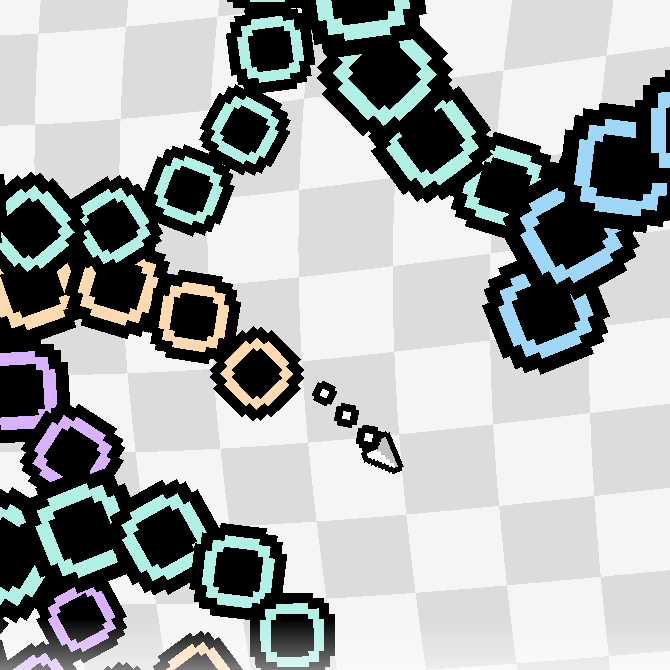

# Loooooooop

A very small game jam game  
Originally made in 6 hours  

## License & credits

Fonts  
- Ari-W9500 by Catterio - [Link (Fontstruct)](https://fontstruct.com/fontstructions/show/2368522/ari-w9500)
	- Released under Public Domain

Music  
- I/O by Bee Hunter - [Link (Newgrounds)](https://www.newgrounds.com/audio/listen/1570847)
	- Released under [Attribution-ShareAlike 3.0 Unported](https://creativecommons.org/licenses/by-sa/3.0/legalcode)
	- Slightly cut from start and end to loop perfectly
	- Effects (reverb and lowpass) apply on death

Graphics  
- Cursor Pixel Pack by Kenney - [Link (kenney.nl)](https://www.kenney.nl/assets/cursor-pixel-pack)
	- Released under Creative Commons CC0

Source & other assets
- Background shader by magicpoint [Link (godotshaders.com)](https://godotshaders.com/shader/gooby-gop/)
	- Released under Creative Commons CC0

- Everything else by Tossu - [Link (tossugames.com)](https://tossugames.com)
	- Released under MIT
	- Use the code for whatever you want! PRs also welcome
